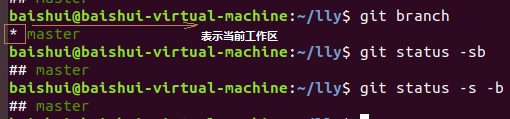

# Git安装和使用

在不同的Linux发行版中安装Git时会看到有git和git-core两个不同的名称

使用命令安装

```Linux
sudo apt install git-all
```

git软件包包含了大部分的Git命令，是必装的软件包

软件包 git-svn git-gui gitk git-email本来也是Git软件包的一部分，但是他们需要不同的依赖包所以作为单独软件包发布

git-doc包含了Git的HTML格式文档，可以通过执行git help -w <sub-command>用浏览器打开相关子命令的HTML帮助。

Git命令介绍


```
### 初始化命令（将一个文件夹变为一个版本库）
git init
已初始化空的 Git 仓库于 /home/baishui/.git/
### 查看git仓库状态（-s精简显示 -sb(-s -b)显示当前工作分支）
git status -s
### 查看git版本号
git --version
### 添加文件到仓库
git add 文件名
### 然后提交
git commit -m "说明"
### 当在子目录中找不到.git仓库时，查看.git仓库在哪个文件夹中
 git rev-parse --git-dir
/home/baishui/lly/.git
### 显示工作区根目录
git rev-parse --show-toplevel
/home/baishui/lly
### 查看当前是在工作区的哪个子目录下 
git rev-parse --show-prefix
a/
### 查看回到工作目录的深度
git rev-parse --show-cdup
../../../
### 修改文件后必须重新添加在提交
### 查看提交队列的任务
1、git diff --cached
diff --git a/welcome.txt b/welcome.txt
index 6001a35..5710975 100644
--- a/welcome.txt
+++ b/welcome.txt
@@ -1,4 +1,3 @@
 Hello World!
 Nice to meet you
 
-very good
2、git diff --staged
diff --git a/welcome.txt b/welcome.txt
index 6001a35..5710975 100644
--- a/welcome.txt
+++ b/welcome.txt
@@ -1,4 +1,3 @@
 Hello World!
 Nice to meet you
 
-very good

### 查看日志是否提交成功
git log --pretty=oneline
```


```Linux
### 将版本库HEAD中的内容显示像目录树一样 -l可以查看文件大小
git ls-tree -l HEAD
### 显示暂存区的文件大小
git ls-files -s
### 显示暂存区目录树
1、先将目录树写进暂存区
git write-tree
git ls-tree 暂存区编号
2、递归显示暂存区的目录树
git write-tree | xargs git ls-tree -lrt
```


```linux
### 清除工作区当前的改动
git clean -fd
### 刷新暂存区
git checkout .
### 保存工作进度
git stash
### 40位HASH值介绍
git log --pretty=raw
commit 60ecb717116aee4a4953c452ffab8318cdb6e8dd：这是本次提交的唯一标识
tree 57f3c3ed6fb4b155ac7fa89c62c8c07c86b9674f:这是本次提交所对应的目录树
parent f4da165c8e1ff6149e33cc586618b70458d07ee4:这是本地提交的父提交
### 查看三个ID的类型
git cat-file -t ID号
```


```git
### 查看对应ID号的内容
git cat-file -p ID号
```


```
### 显示当前工作分支
git branch
git status -sb
git status -s -b
```



```
git log -l HEAD
git log -l master
git log refs/heads/master
### 三条命令显示内容一致，都是指向一个最新的提交
```


``` 
### 查看HEAD的提交内容
git cat-file commit HEAD
### 查看提交信息总共包含多少个字节
git cat-file commit HEAD | wc -c
### 查看版本库中文件的内容
git cat-file blob HEAD:welcome.txt
### 查看文件共有多少个字节的内容
git cat-file blob HEAD:welcome.txt | wc -c
#@# 查看版本库中对应文件的哈希值
git rev-parse HEAD:welcome.txt
### 查看树的内容多大
git cat-file tree HEAD^{tree}| wc -c
### 得到树的哈希值
git rev-parse HEAD^{tree}
### 查看提交日志
git log --graph --oneline
### 回到之前的提交使用reset（慎用）
1、回到上一次提交的结果
git reset --hard HEAD^
使用之后想回到重置前的结果方法
1、使用命令查看master分支的日志文件
tail -5 .git/logs/refs/heads/master
使用git reflog命令
git reflog master | head -5
### 重置master为两次改变前的值
git reflog --hard master@{2}

```

